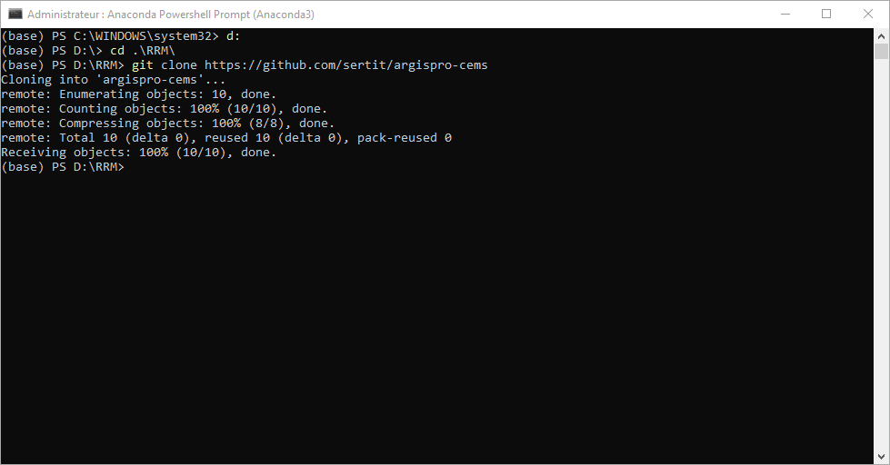
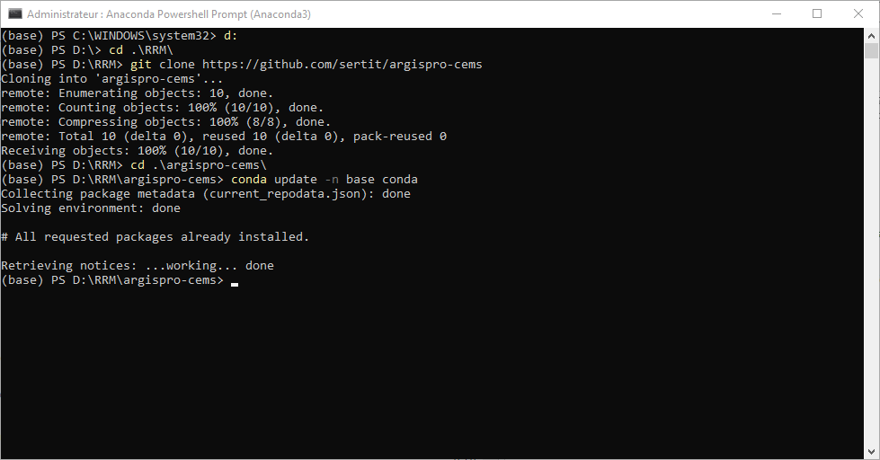
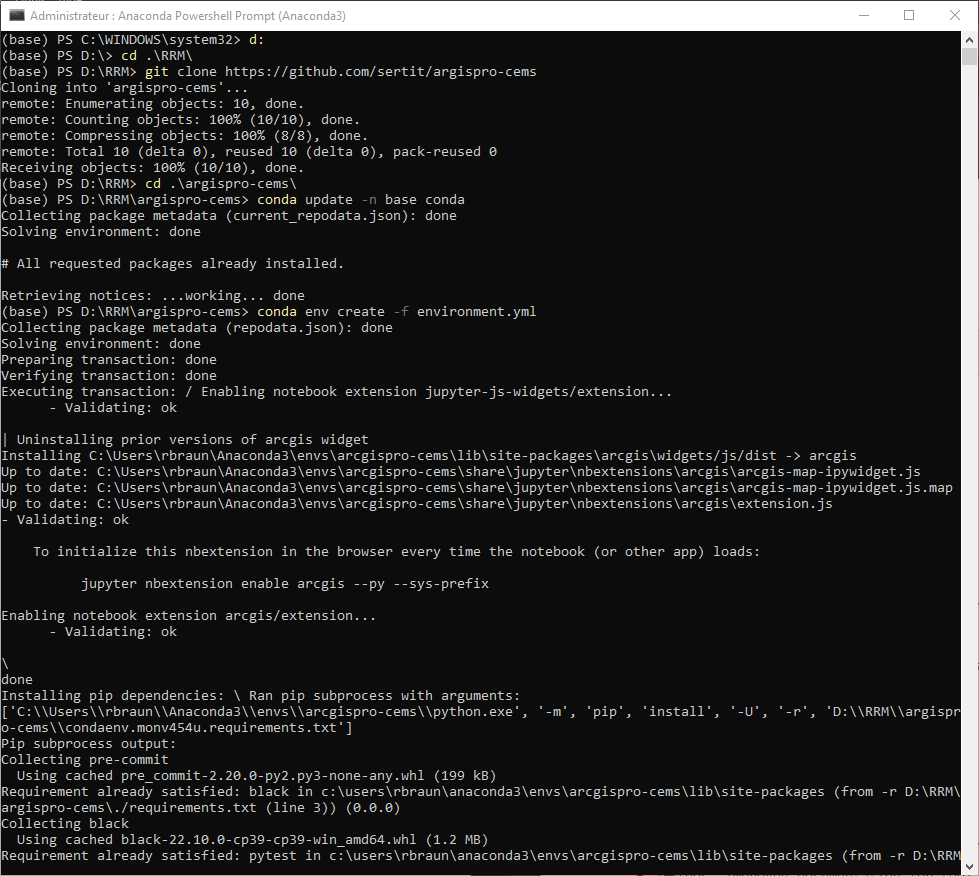
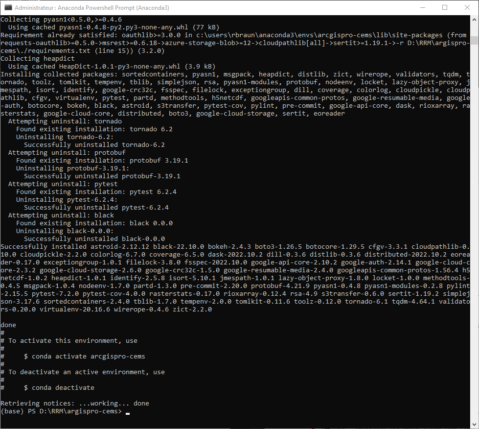
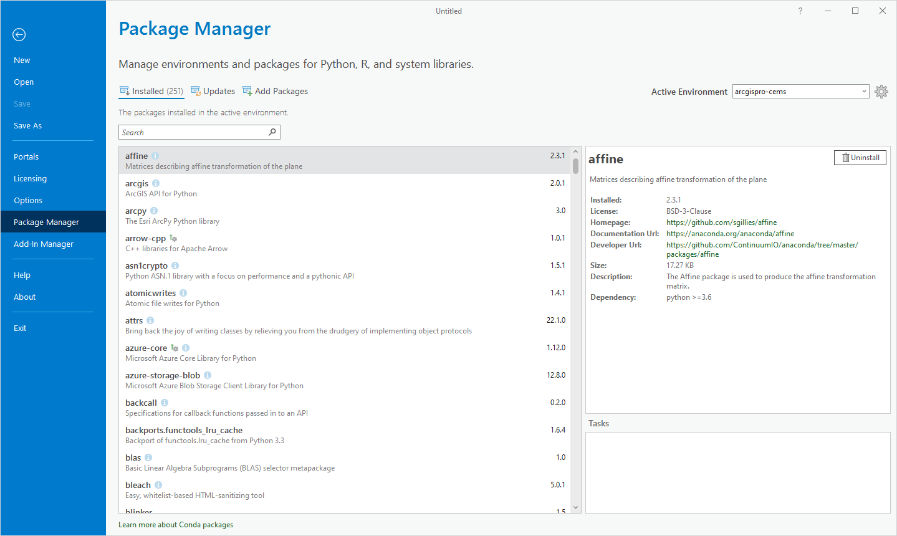
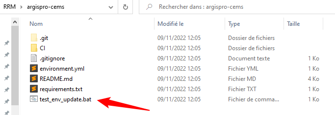
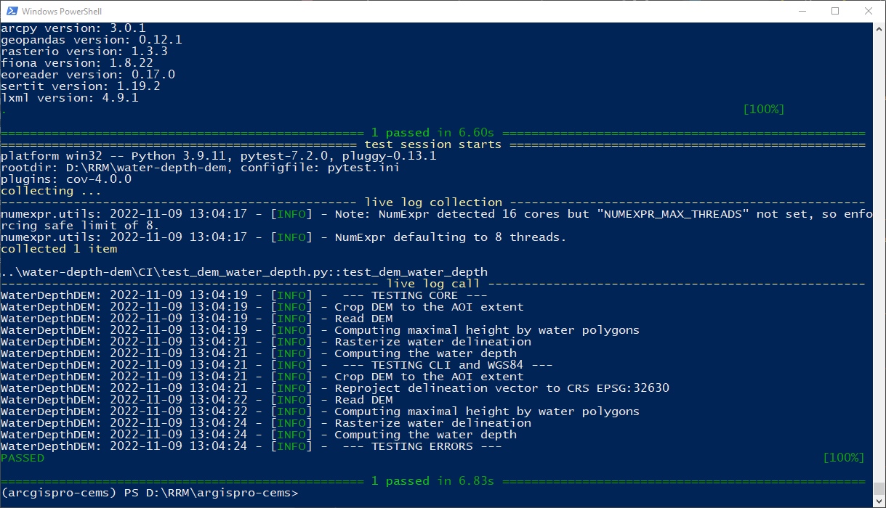

> ⚠ You need ArcGIS Pro 3.0 to use this environment!

# How to set up ArcGIS Pro conda environment

1. If not done already please install [Anaconda](https://docs.anaconda.com/anaconda/install/) and [Git Bash](https://gitforwindows.org/)
2. First launch Anaconda Powershell prompt **as an administrator** (right click on it)
3. Go to a folder of your choice (`cd ...`, to change disk, type `d:` or `e:`). It would be best to clone it in a folder containing other CEMS tools such as `WaterDepthDEM`  
   
4. Clone this project `git clone https://github.com/sertit/argispro-cems` and `cd argispro-cems`
5. Update conda `conda update -n base conda`  
   
6. Create this environment `conda env create -f environment.yml` (this may take a while)   
   
7. You should have this message if everything is successful:  
   

# Add the environment to ArcGIS Pro
Now you will need to configure ArcGIS Pro to use this new Conda environment. 

1. Launch ArcGIS Pro
2. Go to `Project > Package Manager` and then in the upper right corner, select `argispro-cems` 
   
3. Press OK. Eventually, activate this environment, press OK and restart ArcGIS Pro.

# How to update ArcGIS Pro conda environment

There are two possible scenarios :
1. ArcGIS Pro didn't change, so you are simply updating the content of the environment (e.g. getting a new version of a library)
2. ArcGIS Pro did change

## No new version of ArcGIS Pro

1. Go to the folder (`cd ...`) where this project `git clone https://github.com/sertit/argispro-cems` was cloned
2. To be sure, pull the last environment version: `git pull`
3. Open an Anaconda Powershell as **administrator**
4. Update conda `conda update -n base conda`
5. Update this environment with the specified wheels `conda env update -f environment.yml`

## New version of ArcGIS Pro

1. Update to a new version of ArcGIS Pro
2. Go to the folder (`cd ...`) where this project `git clone https://github.com/sertit/argispro-cems` was cloned
3. To be sure, pull the last environment version: `git pull`
4. Open an Anaconda Powershell as **administrator**
5. Update conda `conda update -n base conda`
6. Delete the conda environment `conda env remove -n argispro-cems`

## Tests to do in order to check if everything is alright

Just double-click on the `test_env_update.bat` file.  
  
  
A lot of logs about `Windows fatal exception: code 0xe0000001` may be displayed, but this isn't a problem as long as the tests finish as `passed`

> ⚠ Note: the tool will try to run the `WaterDepthDEM` tests and will succeed if the tool folder is next to `argispro-cems`

## Known errors

### `ImportError: DLL load failed while importing _network`

See https://github.com/pyproj4/pyproj/issues/770 
TLDR: 
- Install the [Microsoft Visual C++ Redistributable for Visual Studio 2015, 2017 and 2019.](https://docs.microsoft.com/en-US/cpp/windows/latest-supported-vc-redist?view=msvc-170)
- In your Anaconda Powershell Prompt:  
  - `conda activate argispro-cems`
  - `conda update pyproj -c conda-forge`

### `from lxml import etree ImportError: DLL load failed: Le module spécifié est introuvable.`
In your Anaconda Powershell Prompt:  
  - `conda activate argispro-cems`
- `pip uninstall lxml -y`
- `pip install lxml`